# 🚀 ContractClarity — 对簿AI

### AI-Powered Contract Risk Intelligence, Strategic Negotiation & Automated Revision Engine

<p align="center">
  
  
  
  
  
  
</p>

---

## 📖 Overview

**ContractClarity** is a production-oriented AI LegalTech system designed to perform deep contract risk intelligence rather than simple surface-level clause summarization.

It integrates:

* 🔍 Retrieval-Augmented Generation (RAG)
* 📚 Domain-specific legal vector database
* 🧠 Multi-stage LLM reasoning
* ⚖️ Structured legal-grounded analysis
* 🤝 Negotiation strategy automation

This system moves beyond “chatbot-style contract explanation” and delivers structured legal risk intelligence, quantitative scoring, and strategic negotiation guidance.

## ❓ Why ContractClarity?

Traditional contract review is:

- Time-consuming and manually intensive
- Dependent on individual legal expertise
- Inaccessible for SMEs without legal counsel
- Vulnerable to oversight in high-volume reviews
- Not structured for measurable risk assessment

Generic LLM tools provide explanations but often:

- Lack legal grounding
- Hallucinate regulatory references
- Fail to produce structured outputs
- Cannot quantify contract risk

**ContractClarity bridges this gap** by combining domain-specific legal retrieval with structured AI reasoning and negotiation intelligence.


---


## 🖥 Product Interface


### 🏠 Access & Contract Initialization

<p align="center">
  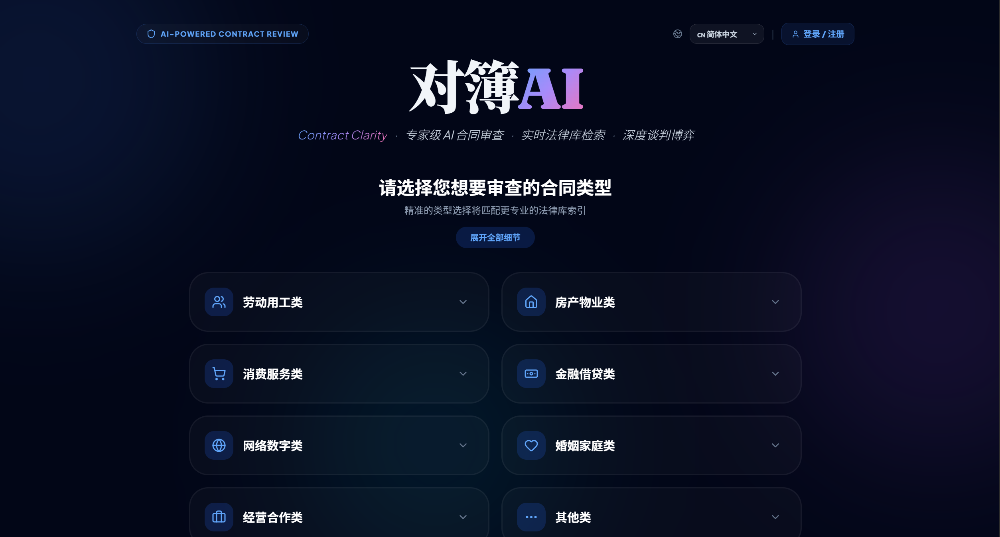
</p>

Users can select the system language, register, log in, and choose the contract type on the homepage.

<p align="center">
  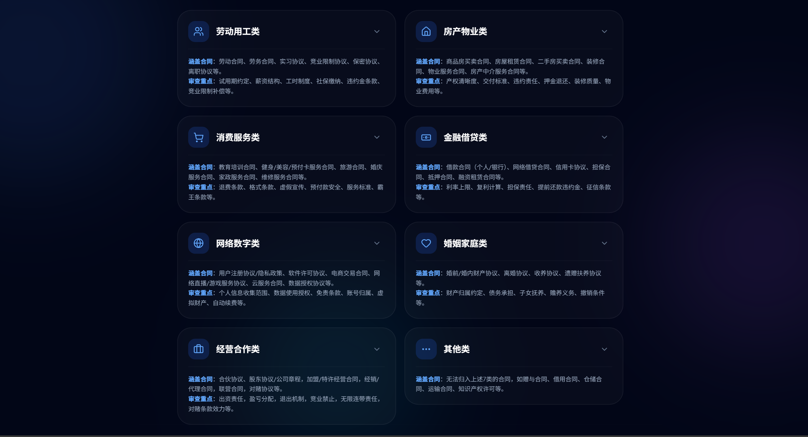
</p>

Users select specialized contract categories to activate domain-specific legal routing.


<p align="center">
  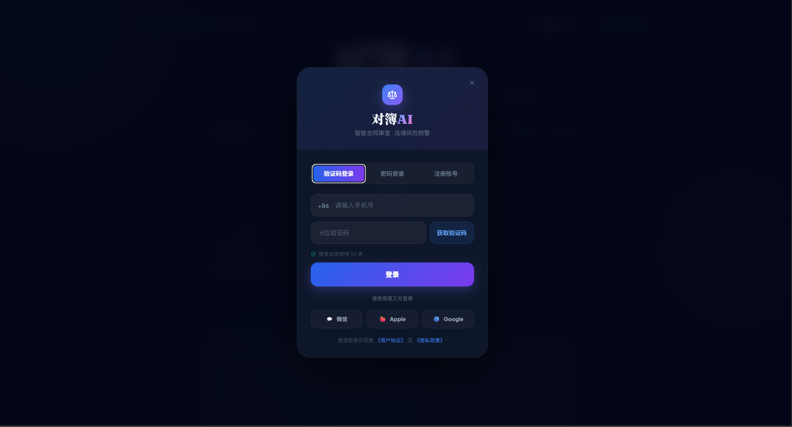
</p>

Secure login via:

- Verification code (OTP)
- Account & password
- JWT-based session management


### 📄 Contract Upload & Submission

<p align="center">
  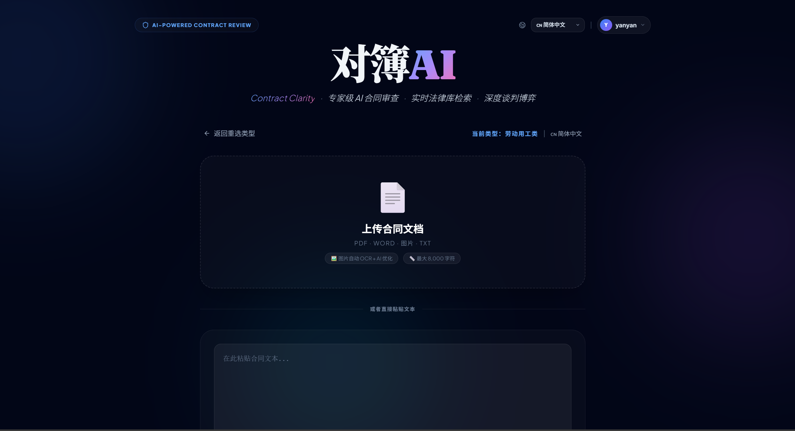
</p>

Supports contract upload (PDF, TXT, DOC, images) and text paste submission.


### ⚙️ AI Review Processing

<p align="center">
  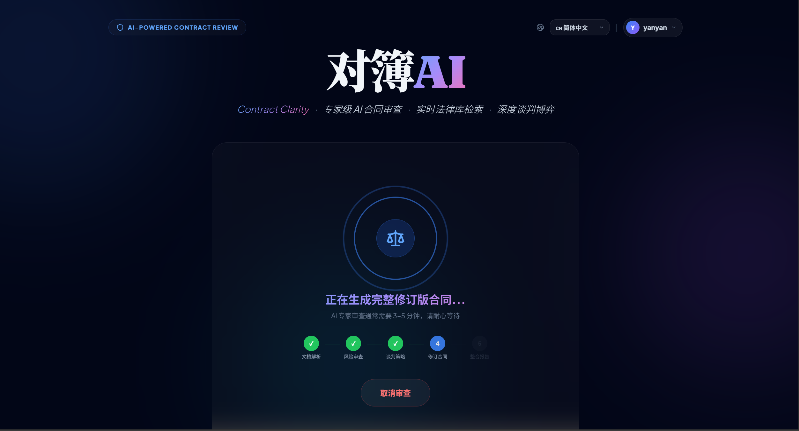
</p>

The system performs:

* Legal retrieval (RAG)
* Clause-level semantic parsing
* Multi-stage risk reasoning
* Game Discourse Generation
* Complete Contract Revision
* Quantitative scoring


## 🔎 Risk Intelligence Dashboard


### 📊 Overall Risk Overview

<p align="center">
  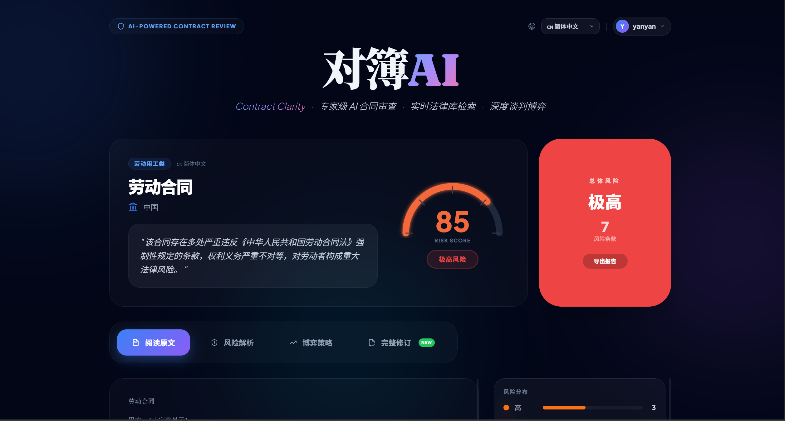
</p>

Provides:

* Risk severity level
* Risk score (0–100)
* Contract Evaluation
* Report Export


### 📝 Contract Risk Highlighting

<p align="center">
  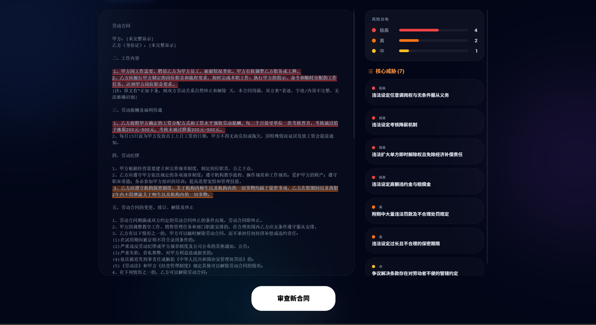
</p>

Clause-level risk highlighting directly inside the contract body.


### 🔬 Deep Risk Detail Analysis

<p align="center">
  
  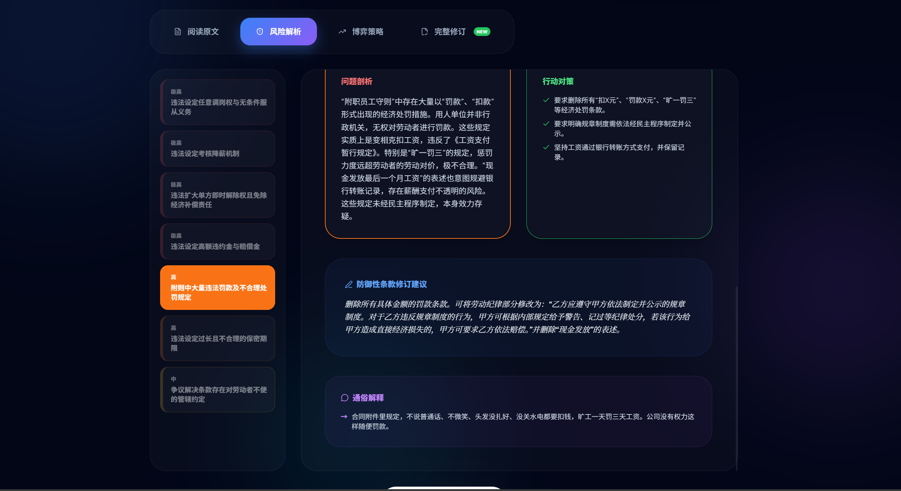
</p>

Each high-risk issue includes:

* Original Statement
* Legal Basis
* Problem Analysis
* Action Strategies
* Revision Suggestions
* Plain Explanation


## ✉️ AI Negotiation Strategy Generator


### 📞 Phone Script & Multi-Style Strategy

<p align="center">
  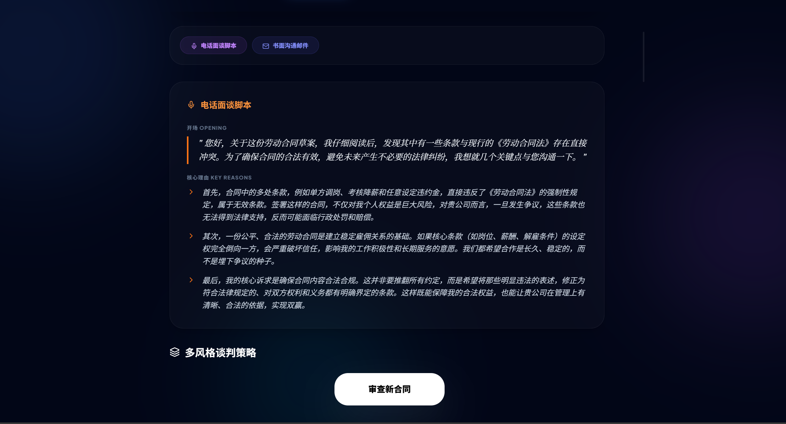
  
</p>

Automatically generates:

* Structured negotiation talking points
* Aggressive / Consultative / Compromise styles


### 📧 Written Communication Templates

<p align="center">
  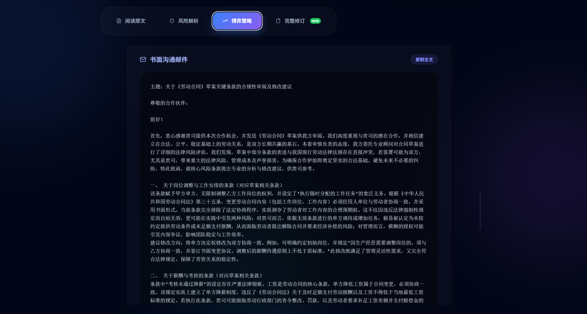
</p>

Produces professional negotiation emails grounded in legal reasoning.


## 🛠 Contract Revision Engine


### 📜 Full Contract Revision

<p align="center">
  
  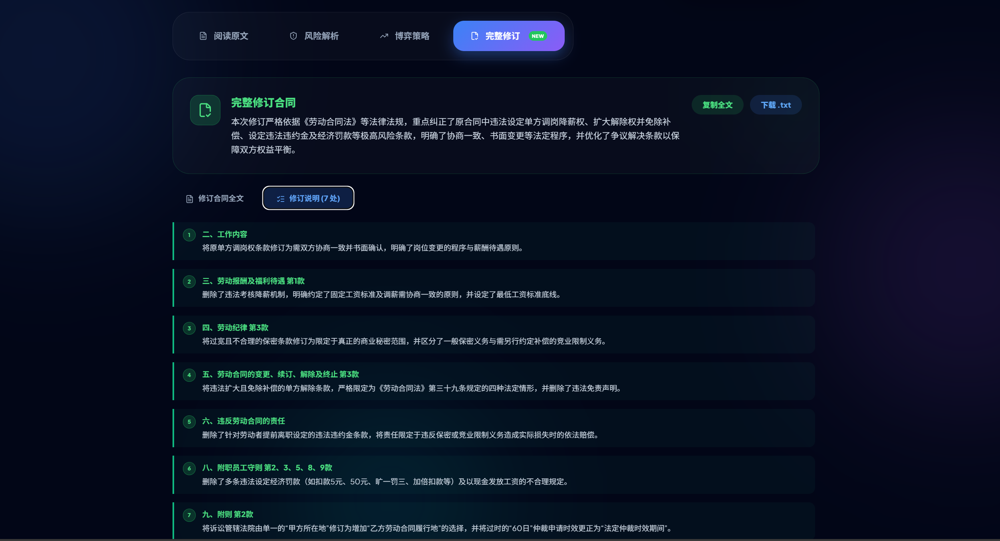
</p>

Provides:

* Full revised contract draft
* Inline modification notes
* Risk-justified adjustments


## 📁 User Dashboard & Archive


### 🧾 Contract Management System

<p align="center">
  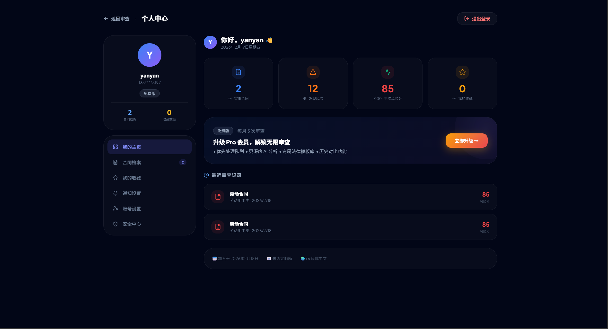
  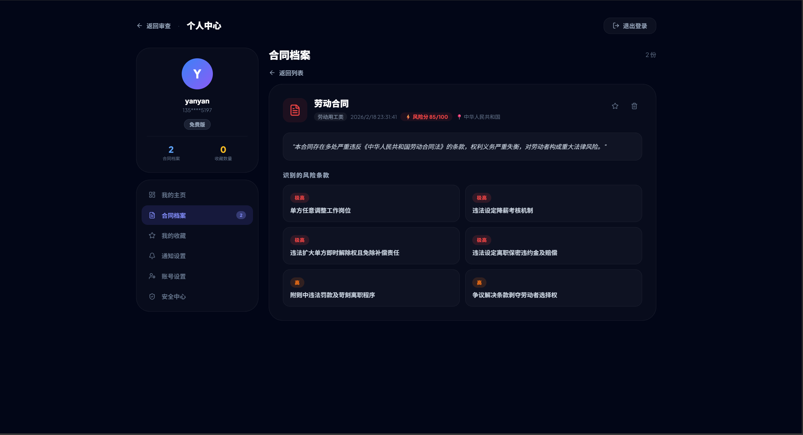
</p>

Includes:

* User System Settings
* Historical contract archive
* Review status tracking
* Risk score comparison
* Structured report retrieval

---

## 🧠 System Architecture

<p align="center">
  
</p>

### Pipeline Flow

```
User Input
   ↓
Frontend (HTML UI)
   ↓
Flask Backend (app.py)
   ↓
Category Router
   ↓
Chroma Vector DB (Legal Corpus)
   ↓
Embedding Model (bge-large-zh-v1.5)
   ↓
DeepSeek LLM
   ↓
Structured JSON Response
```

---

## 🧠 Engineering Highlights

### 🔹 Category-Based Vector Partitioning

Legal corpus is partitioned by contract category, reducing noise and improving retrieval precision.


### 🔹 Controlled Text Chunking Strategy

- Chunk size: 600
- Overlap: 60
- Designed to preserve legal clause integrity
- Prevent semantic fragmentation


### 🔹 Structured JSON Output Enforcement

The LLM is constrained to return structured JSON schema:

- overallRisk
- riskScore
- issues[]
- legalBasis
- mitigationAdvice

This ensures deterministic integration with the frontend.


### 🔹 Multi-Stage Reasoning Pipeline

1. Legal Retrieval (RAG)
2. Risk Identification
3. Strategic Negotiation Modeling
4. Contract Revision Drafting


### 🔹 Asynchronous Task Processing

Long-running analysis is executed via task-based architecture:

- `/analyze` creates task
- `/status/<task_id>` retrieves result

---

## 🧱 Project Structure

```bash
ContractClarity/
│
├── backend/
│   ├── app.py                # Core Flask API
│   ├── ingest.py             # Legal corpus vectorization
│   ├── .env.example
│
├── frontend/
│   └── index.html            # UI Interface
│
├── data/
│   └── 法律条文/   # Categorized legal documents
│
├── assets/...
│
├── requirements.txt
├── README.md
└── LICENSE
```

---

## ⚙️ Installation

### 1️⃣ Clone Repository

```bash
git clone https://github.com/yourusername/ContractClarity.git
cd ContractClarity
```

---

### 2️⃣ Install Dependencies

```bash
pip install -r requirements.txt
```

---

### 3️⃣ Configure Environment Variables

Create:

```
backend/.env
```

Add:

```env
DEEPSEEK_API_KEY=your_api_key_here
JWT_SECRET=your_secret_here
```

---

### 4️⃣ Build Legal Vector Database

```bash
cd backend
python ingest.py
```

---

### 5️⃣ Run Server

```bash
python app.py
```

Server runs at:

```
http://localhost:5000
```

---

## 🔌 API Endpoints

### POST `/analyze`

Request:

```json
{
  "text": "contract content",
  "category": "劳动用工类"
}
```

Response:

```json
{
  "task_id": "uuid"
}
```

### GET `/status/<task_id>`

Returns:

```json
{
  "status": "completed",
  "overallRisk": "High",
  "riskScore": 82,
  "issues": [...]
}
```

---

## 🔐 Security Design

ContractClarity incorporates secure backend practices:

### 🔹 Authentication

- JWT-based authentication
- Access & refresh token separation
- Token expiration enforcement

### 🔹 OTP Protection

- Time-limited verification codes
- Maximum attempt restrictions
- Replay prevention

### 🔹 Data Protection

- Environment variable isolation
- No API keys stored in repository
- Input validation & sanitization

### 🔹 API Safety

- Task-based execution prevents blocking
- Structured response format prevents injection

---

## 🎯 Core Capabilities

### 🔍 Deep Structural Risk Auditing

* Liability asymmetry detection
* Missing clause identification
* Regulatory compliance checks


### ⚖️ Law-Grounded Retrieval

* Category-based vector search
* Embedding model: `BAAI/bge-large-zh-v1.5`
* Similarity-based legal citation


### 📊 Quantitative Risk Scoring

Produces:

* `overallRisk`
* `riskScore`
* Severity breakdown


### 🤝 AI Negotiation Co-Pilot

Generates:

* Formal legal emails
* Strategic persuasion scripts
* Multi-style negotiation pathways

---

## ⚠️ Limitations

- Depends on external LLM API
- Legal corpus limited to provided dataset
- Not a substitute for licensed legal advice


## 🚀 Future Roadmap

* Multi-jurisdiction legal system support
* Docker deployment
* Frontend migration to React
* SaaS deployment version

---

## 📄 License

This project is licensed under the MIT License – see the [LICENSE](LICENSE) file for details.

---
